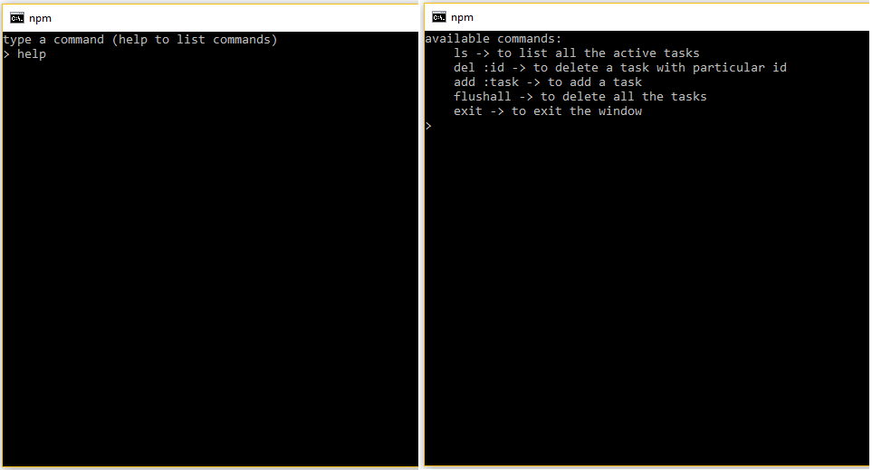
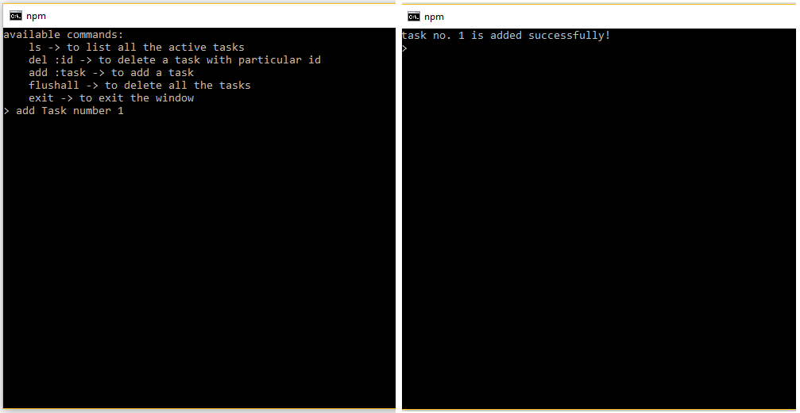
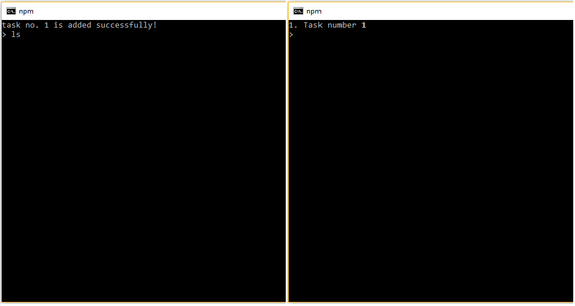
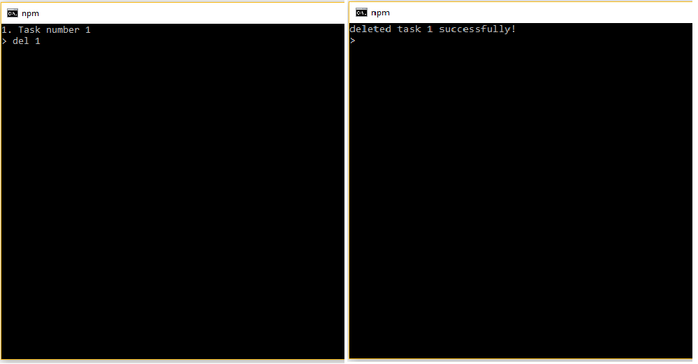
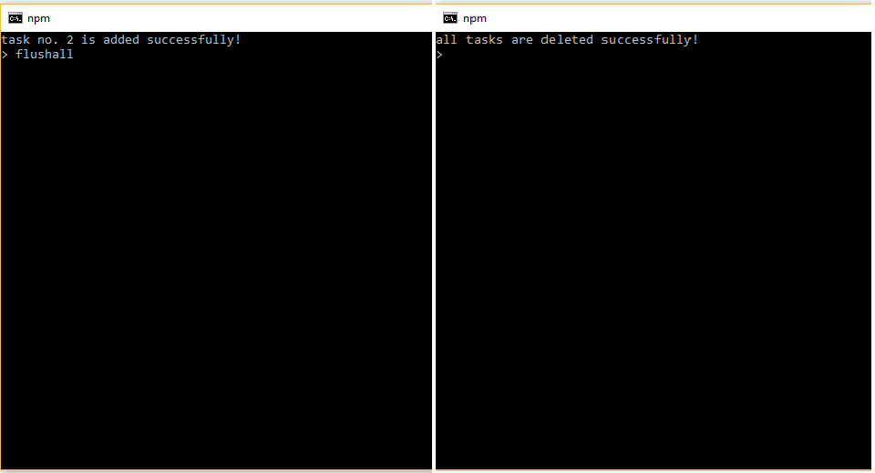

# Tast List Manager
This is a command line utility, made with love using Node.js and Babel. It exploits Node's Event Loop by using instanciating EventEmitter Class and emitting / catching named events.

There are 5 unique user inputs (commands), each performing different jobs.
```c
1. help: Lists all the valid commands and there syntax.
2. add: Add a task in the task list. The syntax can be found by hitting help.
3. del: Delete a task from the list. The syntax can be found by hitting help.
4. ls: Display all the tasks in the list. The syntax can be found by hitting help.
5. flushall: Deleta the whole list. The syntax can be found by hitting help.
6. exit: exit the command line interface.

```

# Installation
### Windows
```sh
$ git clone https://github.com/stillNovice/task-list-manager.git
$ cd task-list-manager
$ npm install
$ npm start

```

### Linux
```sh
$ git clone https://github.com/stillNovice/task-list-manager.git
$ cd task-list-manager
$ npm install
$ sudo npm install -g babel-cli
$ npm start

```

# Screenshots
## CLI starts


## help command


## add command


## ls command


## del command


## flushall command


## exit command
